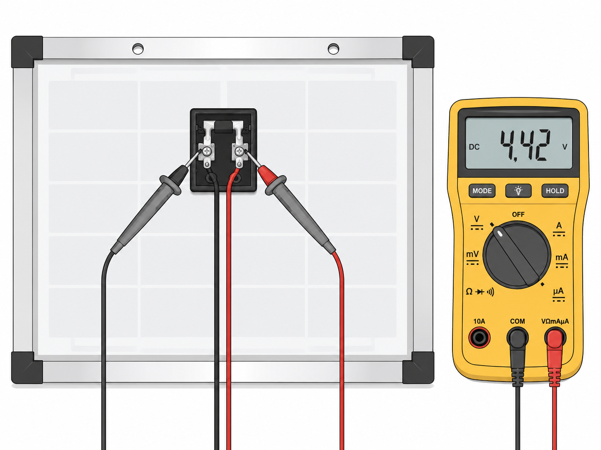
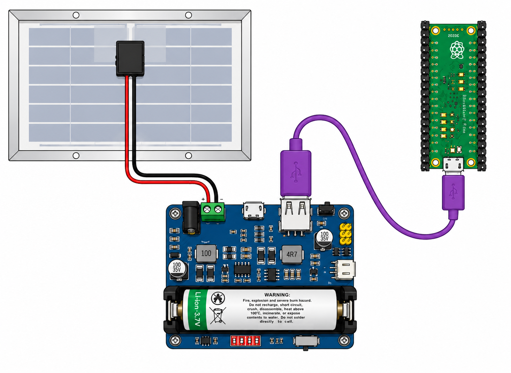

## Solar powered Raspberry Pi Pico

You can power a Raspberry Pi Pico using a solar panel, a solar power management module, and a rechargeable Li-ion battery.

### Recommended equipment

| Item | Basic specs | Online source |
|---|---|---|
| Solar panel | 6 V, 10 W monocrystalline solar panel; 355 × 252 mm option listed. | [Sunstore](https://www.sunstore.co.uk/product/6v-10w-monocrystalline-solar-panel/) |
| Solar power management module | Supports 6 V–24 V solar panel input; charges a 3.7 V rechargeable lithium battery; provides 5 V/1 A or 3.3 V/1 A regulated output; includes MPPT and protection circuits. | [Waveshare](https://www.waveshare.com/solar-power-manager.htm) |
| 14500 Li-ion cell | 14500 rechargeable Li-ion cell; 3.6 V nominal; 820 mAh. | [RS](https://uk.rs-online.com/web/p/speciality-size-rechargeable-batteries/1834300) |
| USB-A to micro-USB cable | USB-A to micro-USB 2.0 cable. | [PiHut](https://thepihut.com/products/usb-to-micro-usb-cable-0-5m) |

### Setup

Many solar panels need wiring before use, and it is not always clear which terminal is positive and which is negative. Before connecting the panel to the solar power management module, test it in sunlight using a multimeter.

Set the multimeter to DC voltage mode. Touch the red probe to one terminal and the black probe to the other terminal. If the multimeter shows a positive voltage, the red probe is touching the positive terminal and the black probe is touching the negative terminal. If the multimeter shows a negative voltage, the probes are reversed.



Once you have identified the positive and negative terminals, connect the solar panel to the solar power management module. Then install the 14500 Li-ion cell, making sure the battery polarity is correct, and connect the Raspberry Pi Pico using the USB-A to micro-USB cable.



Make sure the battery switch is set to **On** so that the Li-ion cell can charge.

## Important safety notes

You must use a **rechargeable 14500 Li-ion cell** with the solar power management module.

Do not use:

- non-rechargeable lithium batteries
- standard AA batteries
- damaged, dented, leaking, or swollen batteries
- batteries inserted with the wrong polarity

A 14500 Li-ion cell is similar in size to an AA battery, but it is not the same type of battery. A standard AA battery must not be used in this module.

### Testing the Raspberry Pi Pico

The Raspberry Pi Pico should start operating once it is powered.

To test that the Pico is powered, save the following program as `main.py` on the Raspberry Pi Pico. The onboard LED will blink once every second.

```python
from picozero import pico_led
from time import sleep

while True:
    pico_led.on()
    sleep(1)
    pico_led.off()
    sleep(1)
```